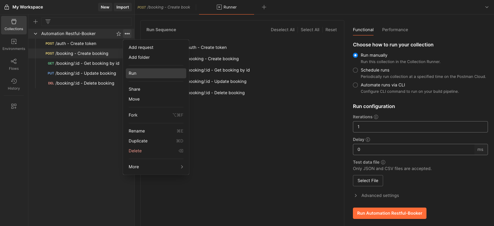
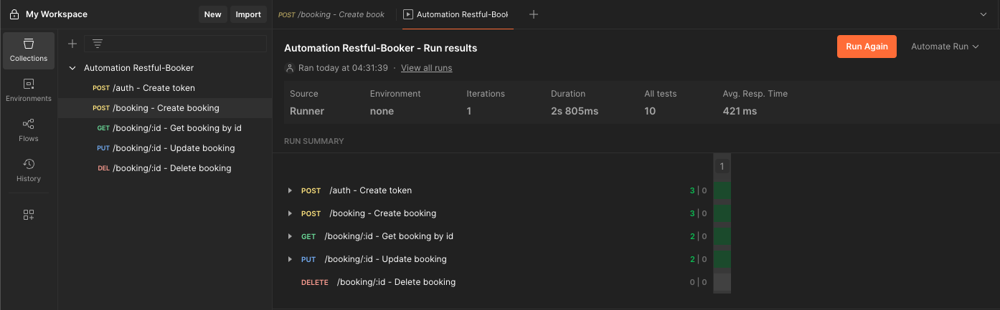
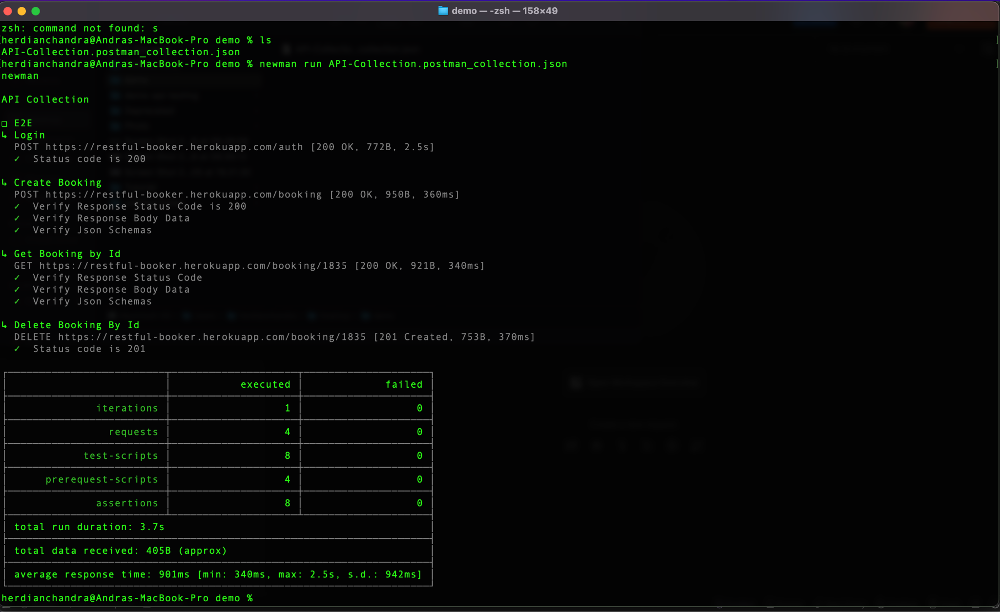
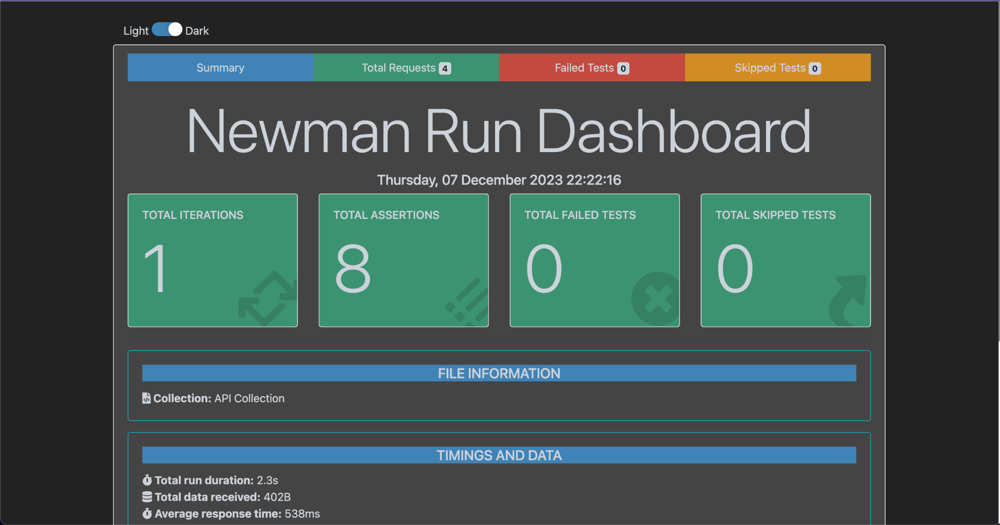

# postman-automation

This project is a simple API automation framework using Postman, allowing tests to be executed either through the Postman Collection Runner or via the Newman CLI.

## Running via Collection

- click three dot in collection variable
- then click Run Automation orange button

  

- here is the run result

  

## Running via Newman CLI

- install dependency

```sh
npm install -g newman
```

Reference:
https://learning.postman.com/docs/collections/using-newman-cli/installing-running-newman/

### Important step before running via newman

- Export the Collection of API
- Export the Environment (if any)
- Run collection via Terminal(macOS) or cmd(Windows) through directory

```sh
newman run myCollectionName.json
```



## Reporter

- install dependency

```sh
npm install -g newman-reporter-htmlextra
```

Reference:
https://www.npmjs.com/package/newman-reporter-htmlextra


